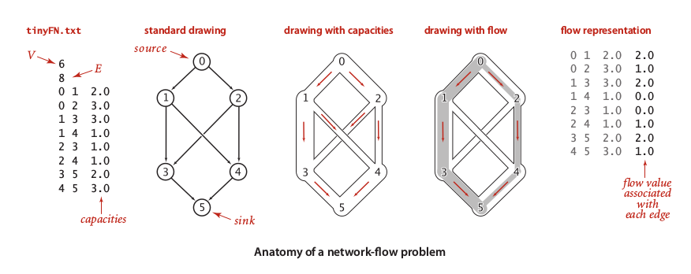
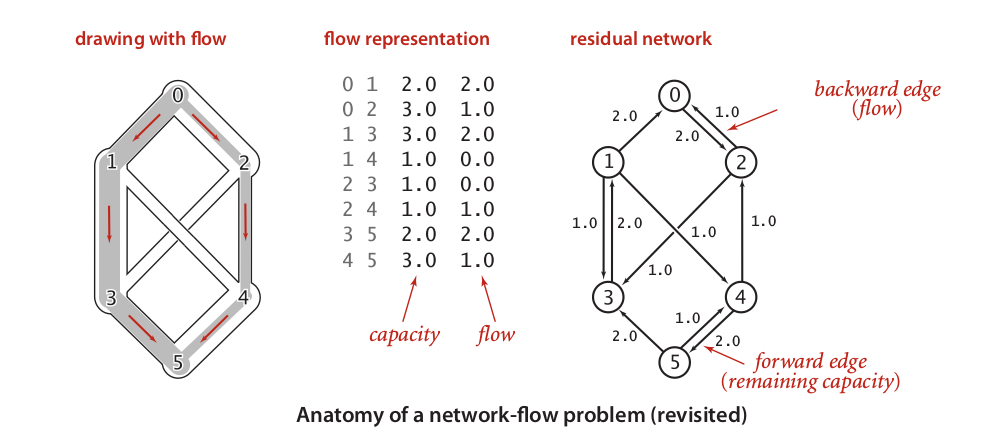
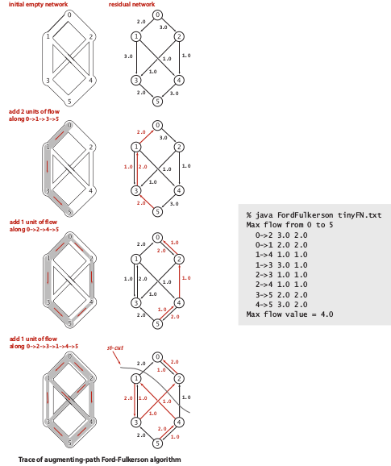
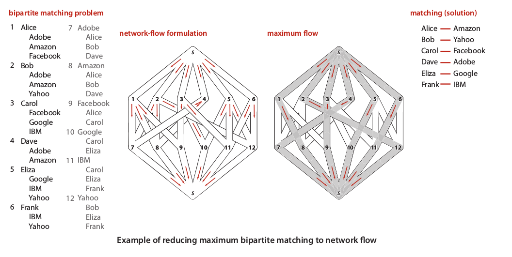
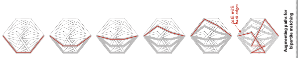
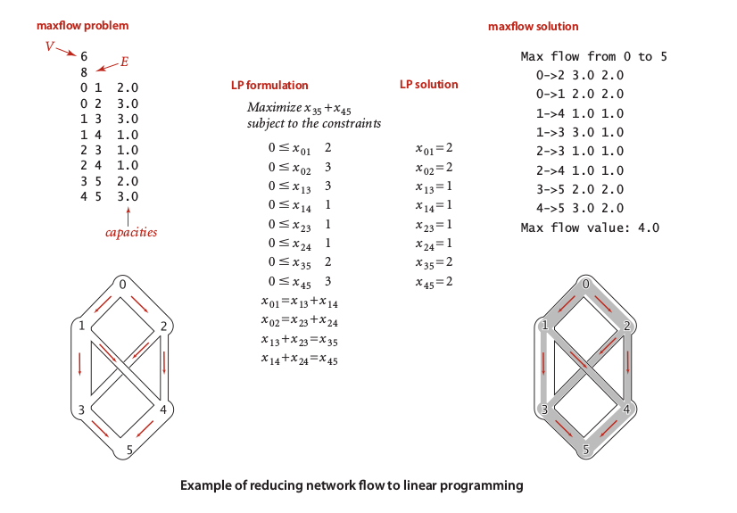

# Network Flow Algorithms {#network-flow-algorithms}

This topic is so interesting, but its not quietly simple as its look like. We will see that this topic extensively used graph only as a tool, its actually a mathematical model that for short is general abstraction of the real complex problem. Study of this topic remains questionable, since there is no one yet could found the linear time algorithms.

Lets take pipe system as analogy to understand this problem. As conventional pipe system, we have bunch of water to be flowing from **source** (**_s_**) to the**sink** (**_t_**). The path between _s_ to _t_isweighted directed edges that represent the pipe. Meanwhile, every edge has a fixed**capacity** (**_c_**) which is maximum volume of water flowing through this pipe and customizable **flow** (**_f_**) which is desired volume of water should be flow. For every interested edge, there is exist a vertex, so then an edge is a connection between v → w. If there are more than one edges going in to or going out from a vertex, than the sum of volumes flows that going out equal to sum of volumes that going in and otherwise, we call this rule as **local equilibrium**. Hence, the local equilibrium should obey the capacity of each edges connected to given vertex. That is, this problem is challenging and non trivial.

Below the example of simple network flow:

The picture above show as ‘flow of water’ from 0 to 5 and the capacities of each intersected pipes between them. Here, we want to do simple task to find maximum flow of water through 0 to 5\. One may decide to open any pipe connections that connecting 0 and 5 directly; _f(__0 – 1 – 3 – 5__)_ _= f1__= 2.0_and _f(__0 – 2 – 4 – 5__)_ _= f2__= 1.0_. They are cheap in the distance, but not maximize desired flow to the sink. Simply, we can maximize flow by open up new connections and redirect some of outflow: _f(0 – 1 – 4 – 5) = f3 = 1.0_, implies that value of _f1_ changed to _1.0_ and _f(0 – 2 – 3 – 5) = f4 = 1.0_, implies that we can increase inflow from _f(0 – 2)_ to _2.0_. That is, any creation of pipe connection and the flow configuration should obey the local equilibrium law and respect the capacity constrains.

Explanation above is a case of find the **max flow**. The interesting characteristic is, we can easily judge the max flow by find its **minimum cut**. Generally, **cuts** is one or more edges that if removed caused a graph to be separated into two set. In this case, we could divide our graph into two set of **_S_** which is contains vertices belong to source vertex and **_T_** which is set of vertices belong to sink. Lets called our pipe system as **_st-flow_**, then our cut should be called as **_st-cut_**.To find the minimum cut, we may implementing a better method. We could transform our flow network into **residual network**that is constructed by **forward edges** (**_fe_**) and **backward edges** (**_be_**). Let say **_c_** is capacity of an edge and **_f_** is configured flow through this edge, then **_fe = c – f_** and **_be = c – fe_**. So, our graph would be looked like the picture below:

We will used **Ford-Fulkerson algorithm**to utilized residual network to find the max flow thorough its minimum cuts. This algorithm relatively simple and could be summarized like this:

1.  Find the augmented path that is connected s and t by implemented any suitable algorithms; DFS, BFS, or whatever.Commonly, we implemented BFS algorithm to fins **shortest-augmenting-path**.

2.  For every residual edges between two vertices, compute its minimum residual capacity**_min(fe, be)_**, then added it into current max flow value.

3.  Then update every residual flow in the graph based on current max flow value.

4.  Repeat this process until there is no possible augmented path.

For better understanding, this algorithm visualized as picture below:

Remember, in this case, value of **_f(st-cut) = max flow = 4_**, since st-cut compute only the minimum residual flow. In this case, this algorithm need at most **_EV/2_** augmenting paths, since two vertices connected by at most two residual flows. Since, the shortest path implementation need **_E_** time, then Ford-Fulkerson algorithm need time at most**_VE_****_2_****_/2_ **time.

Furthermore, our model of graph used here is far more interesting because we could implement this model to solve many practical or even mathematical problems efficiently. For examples, we may use this model as bipartite graph to represent a problem correspondent to matching problems, then use Ford-Fulkerson algorithm to find any max matches; job matching problem, criminal cases or even date partner. In the job matching problem, there are N students that been interviewed to M companies where each of them may interviewed in one or more same companies. The questions is, how we can find student – job connection where all student hired in each distinct corporation?

A picture above show the best match such as each student hired in a corporation. While, the augmented paths found by maximum flow illustrated by a picture below:

Other problem that could be solved by this model is Linear Programming. Some of us who studied economy may dealing with linear programming of their time, since most of economy problems related to maximization or minimization problems. In the vision of linear programming, our graph is very usefulto represent equations and constrains:

That is it, graph is fun and useful model, we love graph!